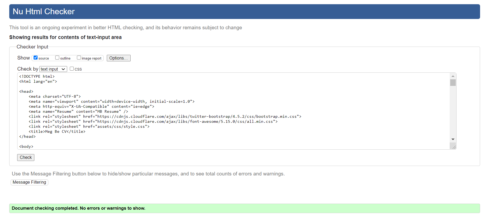
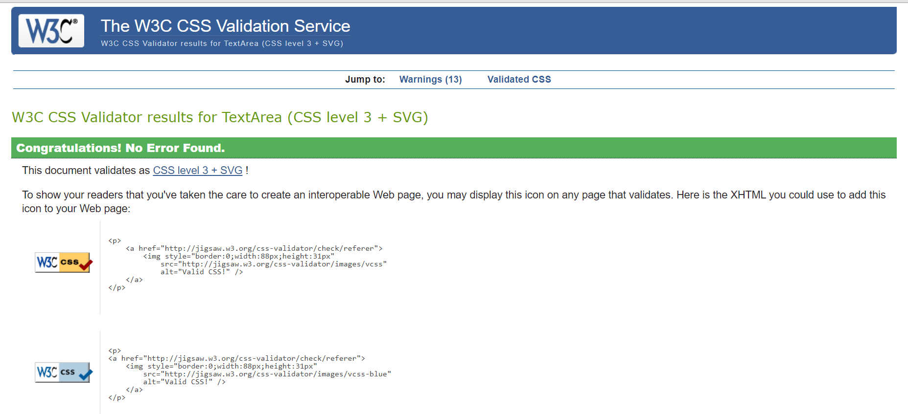
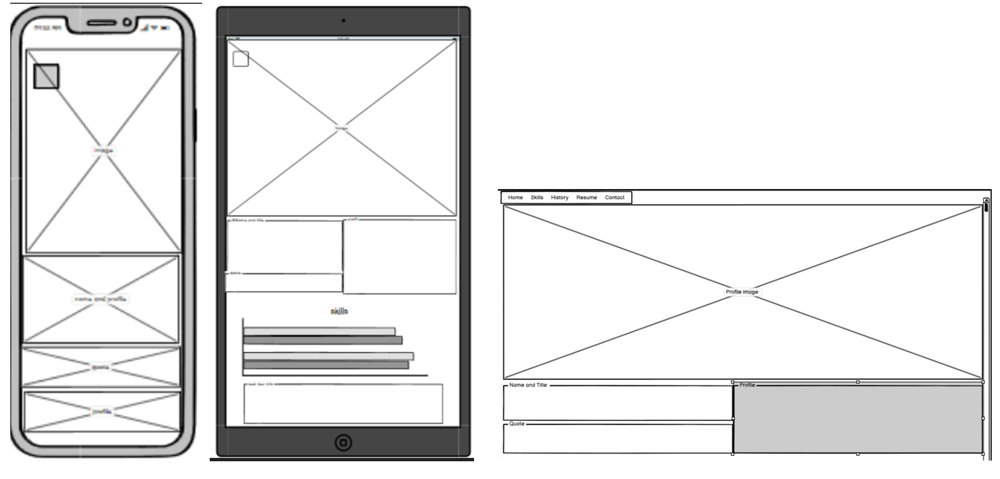
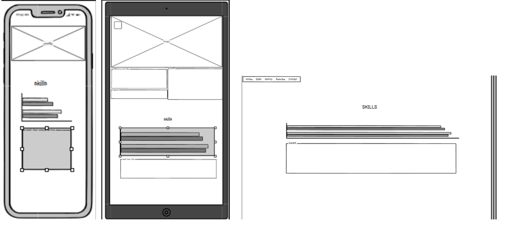
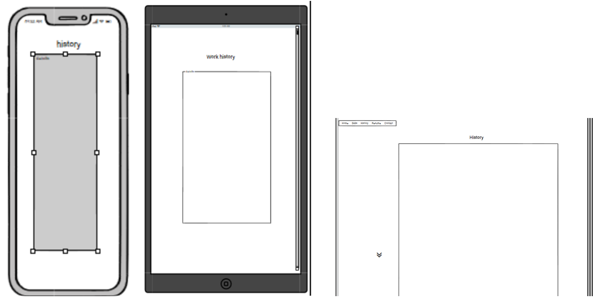
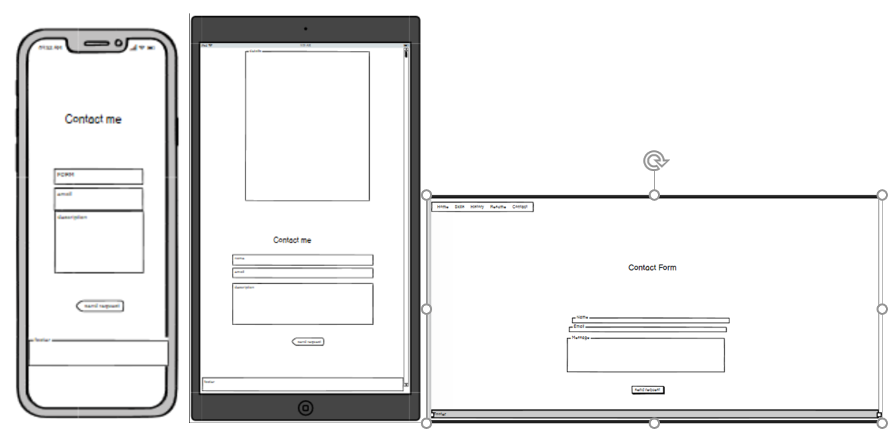

Maggie Bejnar – MS-1 Resume

My three page long resume website, created for employers and recruiters in mind. It is a very brief insight into my web development and employment history. Contains a feature image without personal details. 
This project has been completed during Full Stack Development program created by Code Institute. 
The key points are:
-	Basic HTML, CSS, JS and Bootstrap knowledge
-	Employment history points inclusive of dates, positions and places I have worked for

### LIVE SITE

### USER STORIES     
-	As an employer or recruiter, I would like to see what skills Maggie has achieved in the field of web development.
-	As an employer or recruiter I would like to know what other key employment fields Maggie has worked in. 
-	As an employer or recruiter I would like to see a full CV of this candidate. 
-	I am interested in Maggie’s experience has and would like to find out whether she is open to an interesting position in her area. 

### UX 
The website aims at my future employers, showcase main development skills and other employment experience, the step before reading my CV. Enable easy contact we me in the form section.  
Easy to navigate to find information dur to clear lay out of the page.
Maintain visibility by allowing to open the CV download page and LinkedIn and Facebook access, in separate pages. 
Hover function navigation tabs and footer icons allow better visibility. 

### 5 planes of UX 
- Surface – the page was created in the colour selection which stem from the colours in the main photo for the visual page flow, feature of the navigation bar is available regardless of the position of the page which transition from horizontal to vertical, tabs in the navigation bar relate to main sections of the page and enable quick access to the desired section of the page, CV is accessible to open up on a separate page from the navbar tab or the icon in the footer in pdf version for an easy download, access to social links is from the footer icons which highlight in green when hovered over and open up in a separate page 

- Skeleton – users will navigate through the navigation bar which enable them to move directly to desired section of the page and such are skills, work history and contact without scrolling the page, or to return to the main image, home section, users have an option of the cv pdf download for the more detailed and classical cv view which opens up from the top tab or footer in a separate window, form when correctly submitted returns with submission confirmation and return to home page link, for the smaller screen devices, navigation bar aligns the section tabs vertically down along the left side of the page

- Structure – fixed horizontal navigation bar on top of the page lays out the main sections of the page as skills, employment history and contact form, below feature image gives a space for an imagination to the workplace under which I introduce myself with name, title and brief description of my experience, to follow with visual representation of the web development knowledge, the contact form and footer

- Scope – the page feature key web development skills and information about current studies of this subject at CI, main points of my past employment not directly related to this field and also a form enabling quick contact with me

- Strategy - a flag page for the future employers of the CV key aspects such as web development skills and work experience and which would constitute a step preceding the access to view the CV itself and reach for the contact with me regarding employment or project creation interests, this page will be used to present my employment history and skills, which will be added once the diploma is completed 

### FEATURES 
The website has a responsive fixed-top navigation bar in the header, which enable easy navigation without scrolling down and up the page to reach jump points like skills work history and contact form. 

The contact form requires the input of name and email before submission by clicking on the “Send Request” button of the text that will be sent over to me. After message is sent, it returns with confirmation message that the email has been sent and with the link to return to the home page. 

The Footer has copyright information, media and a CV download icons. Icons’ colours, transition from white to green when hovered over. 

### TECHOLOGIES USED 

-	HTML - coding

-	CSS - styling

-	Bootstrap – helped in a structure format

-	Google fonts - https://fonts.google.com/ - used to produce the correct format to place the fonts into the page

-	Font awesome - https://fontawesome.com/ - used to create icons

### TESTING   

-	HTML W3C Markup Validator]( https://validator.w3.org/#validate_by_input) 

-	W3C CSS Validator ( https://jigsaw.w3.org/css-validator/#validate_by_input) 

-	Problems -from GitHub menu

-	Links to CV pdf and LinkedIn and Facebook pages open from the footer and navbar in new windows.  I have tested them by clicking on the icons/tabs, sites open up in separate windows. 

-	Clicked tabs in navbar: skills, history and contact will jump to position of their relevant heading, click on the home tab allows to return to the main image page. I have tested tabs them by clicking on them both in large and small screen views. 

-	This site was tested on multiple mobile devices and was found to be compatible and responsive on devices above 360px width such as: Galaxy S5, iPhone 6/7/8, iPad.

-	During testing, some of the menus and photos needed to be adjusted. This was achieved using various media query functions.

### TESTING of USER STORIES   

1. Skills achieved in web development 
ACTION - click on skills tab
EXPECTED BEHAVIOUR - page jumps to skills heading, page opens up on skills section 
PASS - Yes

2. Other key employment fields the candidate has worked in. 
ACTION - click on history tab
EXPECTED BEHAVIOUR - page jumps to work history heading, page opens up on work history section
PASS - Yes

3. To see a full CV of this candidate. 
ACTION - click on resume tab
EXPECTED BEHAVIOUR - page opens up in a separate window as a pdf document ready for download
PASS - Yes

4. Write to candidate regarding an interesting position in her area. 
ACTION - click on contact tab
EXPECTED BEHAVIOUR - page jumps to work contact heading, user clicks on send request button, form returns with error message to complete the first name filed, user completes it and click on the button, form returns with error message to complete the email field, user completes it only partially and clicks on button to send it, form returns with an error message to complete it, user completes the email field and try to submit the form, it returns with a message to complete the final, request field, the last field has been filled in, user clicks on the send request button, a new page opens up with the confirmation message thanking for the message just sent and a return to home page link. 
PASS - Yes 

### DEPLOYMENT      

Project was deployed to GitHub Pages by following the below steps: 

-	Sign in to GitHub and locating repository.
-	Select “settings” from the top menu.
-	Scroll down to GitHub Pages section.
-	Under “source” click drop down menu and “none” then select ”master branch”.
-	Page should automatically refresh.
-	The website has now been deployed.
-	Scroll to GitHub Pages section to find the published link.

Forking the GitHub Repository
1.	Sign in to GitHub and locate the GitHub Repository.
2.	Find the “fork” button on the top left-hand side of the screen and below the navigation bar.
3.	By clicking this, you will have a copy of the original repository in your GitHub account.

Make a Local Clone
1.	Sign in to Github and find the repository.
2.	Click the "code" button, located on the right-hand side and above the list of files.
3.	In order to clone the repository, you can do so by HTTPS, SSH and GitHub CLI. Select one and copy the URL.
4.	Open Git Bash.
5.	Change the current working directory to the location you'd like the cloned directory to be made.
6.	Type “git clone” and paste the URL you copied in step 3.
7.	Press Enter. Your local clone should now be created.

### CREDITS
All content was written and produced by the developer. 

### DESIGN
Colours used for the navigation tabs, footer and for the background of name/title and profile, stem from the colours in the main image and visually balance the web page design. 
Layout – the aim was to produce very simple easy to navigate page. 

### RESPONSIVE DESIGN
I have tested the performance of the page on the different screens. I have checked the way pages fold in the smaller screens and found no alignment issues above 360px. 

### MEDIA
Image used is from the free media site: pexels.com, pexels-skitterphoto-705164 .

### ACKOWLEDGMENTS

-	Bootstrap – 4.5v navbar, button, progress bars 

-	W3schools – reference to solve html problems

-	Course Code Institute material – form

-	My mentor Dick Vlaanderen for help and support

### WIREFRAMES

1st page selection includes image, name, title and profile

2nd page includes skills and dev skills info

3rd page includes work history block

4th page contact form

